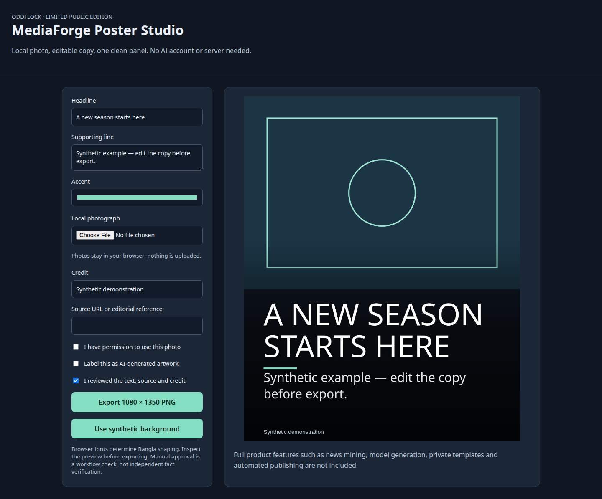

# MediaForge — Limited Public Edition

Runnable source for a deliberately reduced portfolio edition. The full commercial product is a separate private project.

## Run locally

Requires Node.js 22.13 or newer.

```bash
npm ci
npm run dev
```

Open http://127.0.0.1:3411/. The development server binds only to localhost and refuses an occupied port.

```bash
npm run check
npm run build
npm run preview
```

The build creates a static `dist/` folder that can be hosted separately. Publishing this repository does not automatically host a website.

## Included

Manual browser poster editor: editable headline and support text, user-selected local photo, accent colour, credit, source reference, editor approval and 1080×1350 PNG export.

## Source provenance

The deterministic poster composition algorithm is adapted from the authoritative private MediaForge renderer for browser canvas. It now uses a solid text panel and refuses copy that does not fit.

## Limits

News miners, AI generation, commercial templates/brand kits, cloud keys, automatic publication, reel production and private server logic are excluded.

No private accounts, credentials, owner chat logs, customer records or PC paths are bundled. No paid service is contacted. Use synthetic inputs to evaluate the demo.

## Storage and privacy

Photos and copy stay in browser memory; selected photos are not uploaded. Exported PNG files are saved by the user.

## Licensing

Publication permits viewing the source; no blanket permissive licence or commercial IP transfer is granted. Third-party packages keep their licences. See `PUBLIC_SCOPE.md` and `THIRD_PARTY_NOTICES.md`.

## Demo preview



## Preparation evidence

TypeScript check and production build passed. A local browser demonstration completed without page errors. Dependency audit reported zero known advisories at preparation time (5 October 2026). No full application test suite was run. These checks do not certify production readiness.
